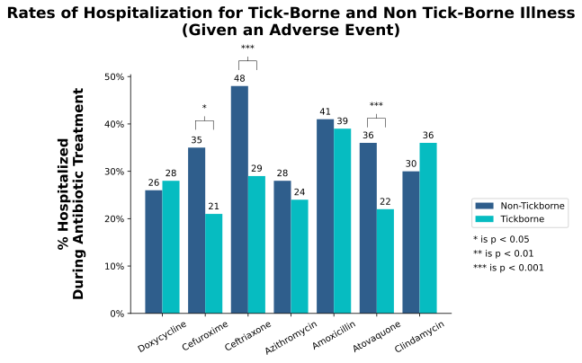
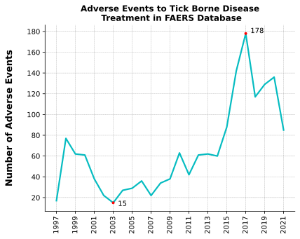
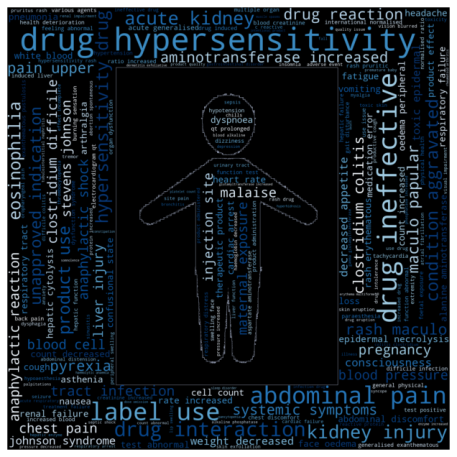

# An Analysis of Tickborne Disease Treatment

This project is exploring the severe reactions that occur during antibiotic treatment of tick-borne disease. The data is retrieved from FAERS (FDA Adverse Events Reporting System) at https://fis.fda.gov. 

In this research I define tick-borne disease as any of the following:
- Lyme Disease (any Borrelia)
- Babesiosis
- Ehrlichiosis
- Rocky Mountain Spotted Fever (any Rickettsia)
- Anaplasmosis
- Southern Tick-Associated Rash Illness
- Tick-Borne Relapsing Fever
- Tularemia
- Q Fever
- Tick-Borne Viral Encephalitis
- Colorado tick fever

Tick-Borne Disease List Sources: 
https://www.cdc.gov/ticks/diseases/index.html, https://www.ecdc.europa.eu/en/tick-borne-diseases

My research will focus on the results of antibiotic tick-borne disease treatment. Specifically these antibiotics:
- Doxycycline
- Cefuroxime
- Ceftriaxone
- Azithromycin
- Amoxicillin
- Atovaquone
- Clindamycin

The ultimate questions & goals this project seeks to address is:

1. Which antibiotic during tick-borne disease treatment is most correlated with severe adverse events (i.e. hospitalization and death) and how does this compare to severe adverse events during non-tick-borne disease treatment? 

2. Is the quantity of reported adverse events substantially growing over time? Are tick-borne diseases a worsening epidemic? 

## Data and Methods

Data was collected by querying the FDA FAERS system for each respective antibiotic and viewing the ‘Listing of Cases’ option. This provides an excel sheet with information on each adverse reaction to the specified antibiotic. By repeating this process for each antibiotic, I collected excel sheets that could be put into pandas data frames in python. After joining them, there are 149,497 individual cases that comprise my current dataset. Further processing was done by extracting only the case reports related to tick borne disease. 

## Summary Statistics

All Antibiotic Data     |  Tickborne Antibiotic Data
:-------------------------:|:-------------------------:
  |  

## Investigation: Tickborne Disease Treatment vs. Other Infections

## Investigation: Tickborne Disease Adverse Events During Treatment Over Time

## Additional Interest: NLP of Documented Adverse Reactions

Tickborne Antibiotic Reactions  |  All Antibiotic Reactions
:-------------------------:|:-------------------------:
  |  