# Tickborne Disease: Hospitalization Risk 

This research aims to critically assess the adverse effects of antibiotic treatment for tickborne disease. Through the use of precise data visualizations, I intend to shed light on the threat that tickborne illnesses pose to our society, and in doing so, help contribute to the formation of future health treatments. A substantial number of people are currently struggling with these zoonotic, tickborne infections. Many do not recover in the manner that medical professionals expect, leaving them searching for relief from their unrelenting symptoms. These are the individuals most at risk of experiencing a dangerous, sometimes life-threatening, adverse event from extended antibiotic treatment. The data for this project was obtained from the FAERS database (FDA Adverse Events Reporting System) at [FIS FDA](https://fis.fda.gov). 

In this research I define tick-borne disease as any of the following:
- Lyme Disease (any Borrelia)
- Babesiosis
- Ehrlichiosis
- Rocky Mountain Spotted Fever (any Rickettsia)
- Anaplasmosis
- Southern Tick-Associated Rash Illness
- Tick-Borne Relapsing Fever
- Tularemia
- Q Fever
- Tick-Borne Viral Encephalitis
- Colorado tick fever

Tick-Borne Disease List Sources: 
[CDC](https://www.cdc.gov/ticks/diseases/index.html),
[ECDC](https://www.ecdc.europa.eu/en/tick-borne-diseases)

My research will focus on the results of antibiotic tick-borne disease treatment ([Treatment Options](https://www.columbia-lyme.org/treatment-options)). Specifically these antibiotics:
- Doxycycline
- Cefuroxime
- Ceftriaxone
- Azithromycin
- Amoxicillin
- Atovaquone
- Clindamycin

The ultimate questions & goals this project seeks to address are:

1. Which antibiotic during tick-borne disease treatment is most correlated with severe adverse events (i.e. hospitalization and death) and how does this compare to severe adverse events during non-tick-borne disease treatment? 

2. Is the quantity of reported adverse events substantially growing over time? Are tick-borne diseases a worsening epidemic? 

## Data and Methods

Data was collected by querying the FDA FAERS system for each respective antibiotic and viewing the ‘Listing of Cases’ option. This option provides an excel sheet with information on each adverse reaction to the specified antibiotic. By repeating this process for each antibiotic, I aggregated the excel sheets and put them into pandas data frames in python. Joining them together and removing duplicates forms the 149,497 individual cases that comprise my current dataset. Further processing was done by extracting only the case reports related to tickborne disease. 

## Summary Statistics

All Antibiotic Data     |  Tickborne Antibiotic Data
:-------------------------:|:-------------------------:
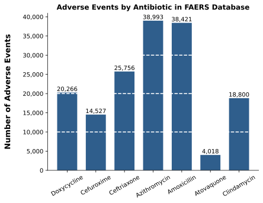  |  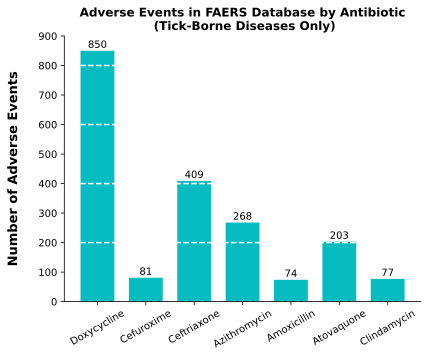

## Investigation: Tickborne Disease Treatment vs. Other Infections

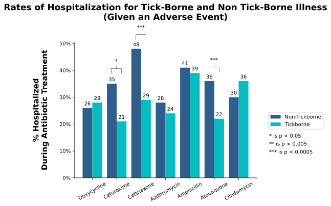

This bar chart showcases the percent difference in hospitalization during treatment between non-tickborne and tickborne diseases (given that the individual experienced an adverse reaction). There are three key takeaways:
- Ceftriaxone, Atovaquone, and Cefuroxime had significantly lower hospitalization rates for tickborne disease treatment compared to non-tickborne disease treatment.  
- Clindamycin and Doxycycline are antibiotics where the hospitalization rate is increased when used for tickborne disease treatment (although not statistically significant with a significance level of 0.05).
- Amoxicillin is most associated with hospitalization during tickborne disease treatment compared to other antibiotics.

### Understanding the statistical significance of the visualization above:

In this section, I used a [Monte Carlo method](https://en.wikipedia.org/wiki/Monte_Carlo_method) of randomly sampling the size of the observed data for 100,000 iterations to estimate the likelihood of getting a distribution similar to that of our observed (tickborne antibiotic hospitalization) data. The output of this random sampling is visualized with the frequency diagrams for each antibiotic. The result of this is an estimated p-value which can be used to assess the statistical significance of the data. Generally, a p-value of less than 0.05 is considered significant enough to reject the null hypothesis (the assumption there is no relationship between the variables and that the difference is just due to sampling). After estimating the p-values, I calculated the actual mathematical p-values using the [binomial test](https://en.wikipedia.org/wiki/Binomial_test). The comparison of these is shown in the bottom right corner of each visualization. They are all statistically significant except for Amoxicillin. 

Monte Carlo Simulation   Using a Normal Distribution as an Estimator of the Binomial Distribution    |  Statistical Significance Comments
:-------------------------:|:-------------------------:
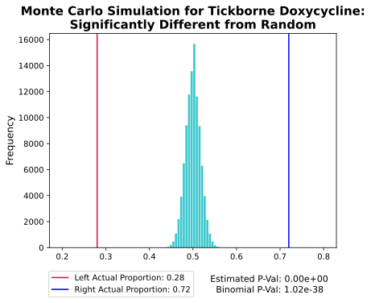  | - No simulated data points were less than the left bound or greater than the right bound.    - Mathematically computed binomial p-value is < 0.001. We **can** safely reject the null hypothesis.  - Tickborne Doxycycline hospitalization **is** statistically significant compared to random. 
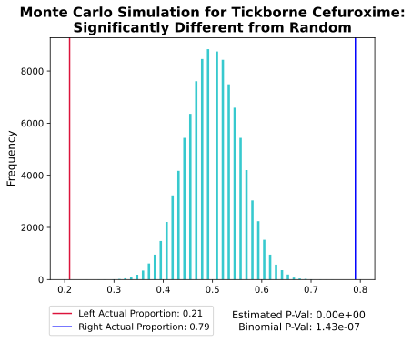  | - No simulated data points were less than the left bound or greater than the right bound.   - Mathematically computed binomial p-value is < 0.001. We **can** safely reject the null hypothesis.  - Tickborne Cefuroxime hospitalization **is** statistically significant compared to random. 
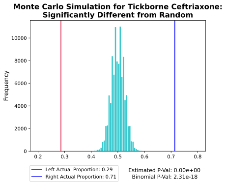  | - No simulated data points were less than the left bound or greater than the right bound.   - Mathematically computed binomial p-value is < 0.001. We **can** safely reject the null hypothesis.  - Tickborne Cefuroxime hospitalization **is** statistically significant compared to random.
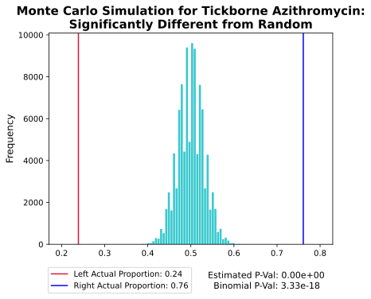  |  - No simulated data points were less than the left bound or greater than the right bound.   - Mathematically computed binomial p-value is < 0.001. We **can** safely reject the null hypothesis.  - Tickborne Azithromycin hospitalization **is** statistically significant compared to random.
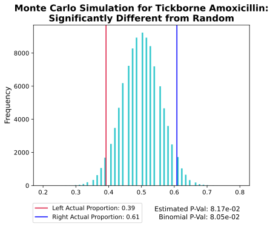  |  - Some simulated data points were less than the left bound or greater than the right bound.   - Mathematically computed binomial p-value is > 0.05. We **cannot** safely reject the null hypothesis.  - Tickborne Amoxicillin hospitalization **is not** statistically significant compared to random.
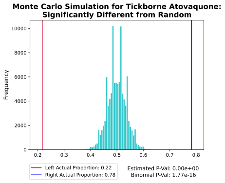  |  - No simulated data points were less than the left bound or greater than the right bound.   - Mathematically computed binomial p-value is < 0.001. We **can** safely reject the null hypothesis.  - Tickborne Atovaquone hospitalization **is** statistically significant compared to random.
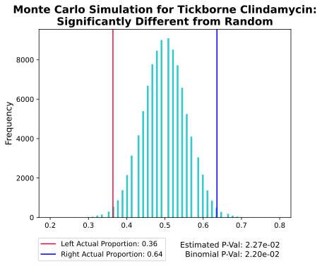  |  - Some simulated data points were less than the left bound or greater than the right bound.   - Mathematically computed binomial p-value is < 0.05. We **can** reject the null hypothesis.  - Tickborne Clindamycin hospitalization **is** statistically significant compared to random.

These histograms serve to illustrate that the likelihood of tickborne hospitalization given an adverse event for each antibiotic is significant, and not due to random chance (except for Amoxicillin). 

## Investigation: Tickborne Disease Adverse Events During Treatment Over Time

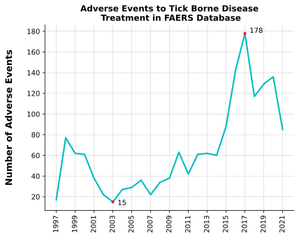

The graphic above shows how reported adverse events to antibiotic therapy for tickborne disease has changed over time. There was a 163 case rise in yearly reported events between 2003 and 2017. 

During the Covid-19 pandemic, visits to ambulatory practices [decreased by nearly 60%](https://www.commonwealthfund.org/publications/2020/apr/impact-covid-19-outpatient-visits#:~:text=The%20number%20of%20visits%20to%20ambulatory%20practices%20declined%20nearly%2060,was%20seen%20before%20the%20pandemic.). It is possible that the decrease in reported adverse events to tickborne antibiotic treatment continued to fall since 2020 because of deferred clinician visits. 

Many researchers have noted that tickborne disease is on the rise. Climate change and global warming are frequently speculated to be the likely culprit for the increase in Lyme disease infections (and other tickborne diseases). The warmer temperatures have been better for tick reproduction and have increased their survivability during the winter. Troy Cullen from William & Mary wrote an [article](https://www.newjerseyhills.com/echoes-sentinel/opinion/letters_to_the_editor/letter-climate-change-and-lyme-disease-how-global-warming-is-already-wreaking-havoc-on-new/article_9e06ed84-676b-5c4a-9d7c-c82d2ef05387.html) about this issue. 

## Additional Interest: NLP of Documented Adverse Reactions

Additional data-visualization showcase using word clouds. The first shows the reactions listed by individuals having an adverse event during treatment. The second graphic shows the reactions listed by individuals having an adverse event during (non-tickborne) antibiotic treatment. The font size of each term is chosen by the number of times the term appears in the documented reactions of the 149,497 case dataset.

## Tickborne Antibiotic Reactions Word Cloud

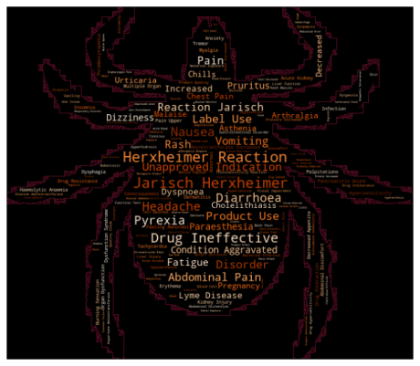

## All Antibiotic Reactions Word Cloud

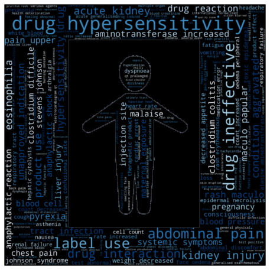

## Curious About my Data Processing & Calculations? 

Everything computed is publically available on my Data-Viz GitHub repository, which you can access here: 

